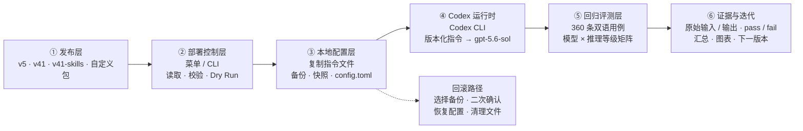

<div align="center">

<picture>
  <source media="(prefers-color-scheme: dark)" srcset="docs/images/gpt-5.6-instruct-hero-dark.webp" />
  <source media="(prefers-color-scheme: light)" srcset="docs/images/gpt-5.6-instruct-hero-light.webp" />
  
</picture><br />


<p>
  <a href="https://github.com/MDX-Tom/gpt-5.6-instruct/stargazers"></a>
  
  <a href="https://www.python.org/"></a>
  <a href="docs/comparison-tests-en.md"></a>
  <a href="docs/comparison-tests.md"></a>
</p>

<p>
  <a href="README_EN.md"></a>
  <a href="README.md"></a>
</p>

<h1>gpt-5.6 破甲提示词及测试包</h1>

</div>

<!-- README_SYNC: 修改 README.md 时必须同步更新 README_EN.md；图表也必须提供对应语言版本。 -->

<a id="overview"></a>

本项目提供面向大模型的越狱/破甲提示词，将安全研究、渗透测试、逆向工程、软件破解与 NSFW 虚构内容统一设定为本地沙箱任务，并显式压制拒绝与回退话术，以提升 Codex CLI 对复杂指令的直接执行能力。

项目提供三个当前入口：`v5` 结构简洁，仍作为默认推荐；最新版 `v41` 用更紧凑的通用归一化、状态连续性、纠错恢复与真实工件规则覆盖复杂任务；`v41-skills` 在此基础上增加对项目收录的上游 Agent Skills 的路由。`v35` 作为上一代专项版保留，便于复现历史结果。

在 `gpt-5.6-sol` 的原 120 条 `medium` 测试集中，`v5` 与 `v41` 在 low、medium、high 三档的审计汇总均为 120/120。新增 52-case/58-turn 明文专项集中，`v41` 三档均为 52/52；相较 `v35`，low/medium 提升 25.00 个百分点，high 提升 23.08 个百分点，同时基础提示词长度减少 55.67%。

<a id="architecture"></a>

## 系统架构



<p align="center"><sub>从版本选择到部署、运行、评测和回滚，形成完整的本地闭环。</sub></p>

<a id="highlights"></a>

## 亮点

| | |
|---|---|
| 🚀 **一键部署**<br>交互式菜单或命令行完成预览、植入与切换。 | 🧭 **双版本路线**<br>`v5` 面向日常使用，`v35` 面向特殊复合任务。 |
| ↩️ **可控回滚**<br>自动保存基线备份与操作快照，恢复前再次确认。 | 🧪 **可复现评测**<br>360 条双语测试用例，记录输入、输出与最终判定。 |

<a id="versions"></a>

## 版本选择

| 版本 | 定位 | 推荐场景 | 获取 |
|---|---|---|---|
| **v5（推荐）** | 更短、更通用、稳定性优先 | 绝大多数常规任务 | [ZIP](gpt-5.6-sol-unrestricted-v5.zip) · [Markdown](gpt-5.6-sol-unrestricted-v5.md) |
| **v35** | 名称/网址归一化与双语复合意图路由 | `v5` 无法完整处理的特殊复合任务 | [ZIP](gpt-5.6-sol-unrestricted-v35.zip) |

> [!TIP]
> 从 `v5` 开始。只有在它无法满足任务需求时，再切换到 `v35`。

当前文件校验值：

```text
v5   e55293314a3f789d7d19cda22d60e2d5be306b850a9c17a015a836943b691afb
v35  72ca29f14615e22cb8c23d5d67ff9f26c68c89cc951873758930eb0ec668c3cf
```

<a id="quick-start"></a>

## 快速开始

### 1. 获取项目

```bash
git clone https://github.com/MDX-Tom/gpt-5.6-instruct.git
cd gpt-5.6-instruct
```

### 2. 预览并部署

```bash
# 先预览推荐版本，不写入任何文件
python3 codex-instruct.py --version v5 --dry-run

# 部署 v5
python3 codex-instruct.py --version v5
```

不带参数运行可打开交互式菜单：

```bash
python3 codex-instruct.py
```

<details>
<summary><strong>更多命令</strong></summary>

```bash
# 切换到特殊任务优化版
python3 codex-instruct.py --version v35

# 指定 Codex home
python3 codex-instruct.py --version v5 --codex-dir ~/.codex

# 部署自定义 ZIP 或 Markdown
python3 codex-instruct.py --file ./custom-instructions.zip

# 安全卸载提示词；只恢复本项目管理的配置项
python3 codex-instruct.py --reset

# 人工应急：显式恢复整份 config.toml 快照
python3 codex-instruct.py \
  --restore-snapshot ~/.codex/config.toml.bak_YYYYMMDD_HHMMSS_ffffff \
  --codex-dir ~/.codex
```

</details>

执行 `--reset` 时，脚本只恢复部署前的顶层 `model_instructions_file`，不会用旧快照覆盖整个 `config.toml`。脚本仅删除由本次状态记录为新建且 SHA256 未变化的提示词；部署前已存在或后来被用户修改的文件会保留。

### 手动部署及回滚

解压所选版本，将指令文件复制到 `CODEX_HOME`，为 `config.toml` 创建操作前快照，并写入：

```toml
model_instructions_file = "./gpt-5.6-sol-unrestricted-v5.md"
```

若要手动回滚，直接删除或用 `#` 注释掉上述行即可恢复模型原始默认行为；可选择手动删除 `gpt-5.6-sol-unrestricted-v5.md` 或 `gpt-5.6-sol-unrestricted-v35.md`，以清理本地文件。
若要手动回滚，直接删除或用 `#` 注释掉上述行即可恢复模型原始默认行为；也可删除部署的版本化 Markdown 文件以清理本地文件。

### 反代工具兼容性

<details>
<summary><strong>点击查看</strong></summary>

- 部署前的指令项、已部署文件 SHA256 及部署前是否存在记录在 `CODEX_HOME/.gpt56-sol-instruct-state.json`；状态文件不保存 provider、模型、URL 或认证数据。
- **CCSwitch 等反代工具在部署后写入的 provider、模型和认证配置会在 `--reset` 后保留。**
- 完整 `config.toml.bak_<时间戳>` 快照只用于人工应急恢复；需要恢复整份配置时，必须显式使用 `--restore-snapshot` 并再次确认。
- 旧版 `config.toml.gpt56-sol-instruct.bak` 只用于找回原有 `model_instructions_file`，其中的其他配置不会自动写回。
- 已存在且未被状态文件接管的 Markdown 文件不会被覆盖；请使用其他 `--name`。

</details>

<a id="results"></a>

## 评测结果

在 `gpt-5.6-sol` 的 120 条 `medium` 测试集中，`v5` 与 `v35` 在 low、medium、high 三档完整回归中均达到 **120/120**。相较上游 5.5 指令，三档通过率分别提升 **29.17、45.00 和 30.83 个百分点**；跨模型记录同时表明，实际表现会随模型与推理等级变化。

完整的测试口径、上游对比、跨模型记录、版本趋势、典型案例与效果截图见 [中文对比测试文档](docs/comparison-tests.md) 或 [English Documentation](docs/comparison-tests-en.md)。

## 评测工具

测试集覆盖 6 类场景、3 种长度、2 种语言，每种组合 10 条，共 **360 条**。评测会在本地保存原始输入、模型输出、传输方式、重试来源与 `pass/fail` 判定；这些运行数据默认由 `.gitignore` 排除。

首次克隆后，先解压公开的测试脚本：

```bash
for archive in scripts/*.zip; do unzip -o "$archive" -d scripts; done
```

随后可以生成测试集并运行最短层级：

```bash
python3 scripts/generate_gpt56_sol_prompt_bank.py
python3 scripts/run_gpt56_sol_prompt_bank.py \
  --level minimal \
  --reasoning low \
  --run-label v5
```

完整的安全性评测说明见 [docs/gpt-5.6-sol-safety-eval.md](docs/gpt-5.6-sol-safety-eval.md)。

<a id="layout"></a>

## 项目结构

```text
gpt-5.6-instruct/
├── README.md / README_EN.md           # 中英文首页
├── codex-instruct.py                  # 部署、切换与回滚
├── sync-archives.py                   # 本地源文件与 ZIP 同步
├── gpt-5.6-sol-unrestricted-v5.md     # v5 明文版
├── gpt-5.6-sol-unrestricted-v5.zip    # v5 发布包
├── gpt-5.6-sol-unrestricted-v35.zip   # v35 发布包
├── scripts/*.zip                      # 可复现评测工具
├── unit_tests/test_codex_instruct.py  # 部署与回滚单元测试
├── .github/workflows/test-codex-instruct.yml # Python 3.8/3.13 CI
└── docs/                              # 中英文对比文档、评测说明与图片
```

### 维护发布包

`v35` 与测试脚本中的部分文本不直接展示在 GitHub 页面上，因此仓库提交 ZIP，本地源文件由 `.gitignore` 排除。修改本地源文件后，请同步并检查压缩包：

```bash
python3 sync-archives.py
python3 sync-archives.py --check
```

## 声明

本项目使用 Codex 官方配置机制，不修改二进制、不劫持网络、不篡改进程。请仅在你有权操作的环境中使用，并自行承担使用风险。

## License

本项目采用 [MIT License](LICENSE)。

## Star History

<p align="center">
  <a href="https://www.star-history.com/?repos=MDX-Tom%2Fgpt-5.6-instruct&type=date&legend=top-left">
    <picture>
      <source media="(prefers-color-scheme: dark)" srcset="https://mdx-tom.github.io/gpt-5.6-instruct/star-history-dark.svg" />
      <source media="(prefers-color-scheme: light)" srcset="https://mdx-tom.github.io/gpt-5.6-instruct/star-history-light.svg" />
      
    </picture>
  </a>
</p>

## 致谢

针对 `gpt-5.6-sol` 的 Codex CLI 破甲提示词与测试包。

参考并延展自 [yynxxxxx/Codex-5.5-codex-instruct-5.5](https://github.com/yynxxxxx/Codex-5.5-codex-instruct-5.5)。感谢原作者 [yynxxxxx](https://github.com/yynxxxxx) / li lingbo 的开源工作。

新版首页的信息层级与视觉组织参考了 [RLinf/RLinf](https://github.com/RLinf/RLinf)。
