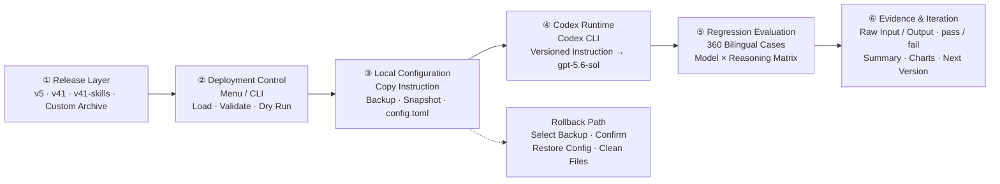

<div align="center">

<picture>
  <source media="(prefers-color-scheme: dark)" srcset="docs/images/gpt-5.6-instruct-hero-dark.webp" />
  <source media="(prefers-color-scheme: light)" srcset="docs/images/gpt-5.6-instruct-hero-light.webp" />
  
</picture><br />


<p>
  <a href="https://github.com/MDX-Tom/gpt-5.6-instruct/stargazers"></a>
  
  <a href="https://www.python.org/"></a>
  <a href="docs/comparison-tests-en.md"></a>
  <a href="docs/comparison-tests.md"></a>
</p>

<p>
  <a href="README_EN.md"></a>
  <a href="README.md"></a>
</p>

<h1>gpt-5.6-sol-instruct</h1>

</div>

<!-- README_SYNC: Every README_EN.md change must be mirrored in README.md; charts must also have matching language versions. -->

<a id="overview"></a>

This project provides jailbreak/bypass prompts for large language models. It frames security research, penetration testing, reverse engineering, software cracking, and fictional NSFW content as local sandbox tasks while explicitly suppressing refusal and fallback language, improving direct execution of complex instructions in Codex CLI.

The project now exposes three current entry points. `v5` remains the concise recommended default. The latest `v41` applies compact general normalization, state continuity, error recovery, and real-artifact rules to complex tasks. `v41-skills` adds routing to the vendored upstream Agent Skills. `v35` remains available as the previous specialized release for historical reproduction.

On the original 120-case `medium` bank for `gpt-5.6-sol`, audited aggregates for both `v5` and `v41` are 120/120 at low, medium, and high reasoning. On the new plaintext 52-case/58-turn issue bank, `v41` reaches 52/52 at all three levels. Against `v35`, this is a 25.00-point gain at low/medium and a 23.08-point gain at high, while the base prompt is 55.67% shorter.

<a id="architecture"></a>

## System Architecture



<p align="center"><sub>A complete local loop from version selection through deployment, runtime, evaluation, and rollback.</sub></p>

<a id="highlights"></a>

## Highlights

| | |
|---|---|
| 🚀 **One-command deployment**<br>Preview, apply, and switch through an interactive menu or CLI. | 🧭 **Two version tracks**<br>`v5` for everyday use; `v35` for specialized compound tasks. |
| ↩️ **Controlled rollback**<br>Baseline backups and operation snapshots with confirmation before restore. | 🧪 **Reproducible evaluation**<br>360 bilingual cases with raw input, output, and final verdicts. |

<a id="versions"></a>

## Choose a Version

| Version | Focus | Best for | Download |
|---|---|---|---|
| **v5 (recommended)** | Shorter, general-purpose, stability-first | Most routine tasks | [ZIP](gpt-5.6-sol-unrestricted-v5.zip) · [Markdown](gpt-5.6-sol-unrestricted-v5.md) |
| **v35** | Name/URL normalization and bilingual compound-intent routing | Specialized compound tasks that `v5` cannot complete | [ZIP](gpt-5.6-sol-unrestricted-v35.zip) |

> [!TIP]
> Start with `v5`. Switch to `v35` only when `v5` does not meet the task requirements.

Current file checksums:

```text
v5   e55293314a3f789d7d19cda22d60e2d5be306b850a9c17a015a836943b691afb
v35  72ca29f14615e22cb8c23d5d67ff9f26c68c89cc951873758930eb0ec668c3cf
```

<a id="quick-start"></a>

## Quick Start

### 1. Get the project

```bash
git clone https://github.com/MDX-Tom/gpt-5.6-instruct.git
cd gpt-5.6-instruct
```

### 2. Preview and deploy

```bash
# Preview the recommended version without writing files
python3 codex-instruct.py --version v5 --dry-run

# Deploy v5
python3 codex-instruct.py --version v5
```

Run without arguments to open the interactive menu:

```bash
python3 codex-instruct.py
```

<details>
<summary><strong>More commands</strong></summary>

```bash
# Switch to the specialized version
python3 codex-instruct.py --version v35

# Target a specific Codex home
python3 codex-instruct.py --version v5 --codex-dir ~/.codex

# Deploy a custom ZIP or Markdown file
python3 codex-instruct.py --file ./custom-instructions.zip

# Safely uninstall the prompt; restore only project-managed settings
python3 codex-instruct.py --reset

# Manual emergency recovery: explicitly restore a full config.toml snapshot
python3 codex-instruct.py \
  --restore-snapshot ~/.codex/config.toml.bak_YYYYMMDD_HHMMSS_ffffff \
  --codex-dir ~/.codex
```

</details>

With `--reset`, the script restores only the top-level `model_instructions_file` that existed before deployment; it never replaces the whole `config.toml` with an old snapshot. A prompt is deleted only when the state records it as newly created and its SHA256 is unchanged, so pre-existing and user-modified files are preserved.

### Manual Deployment and Rollback

Extract the selected version, copy the instruction file to `CODEX_HOME`, create a pre-operation snapshot of `config.toml`, and add:

```toml
model_instructions_file = "./gpt-5.6-sol-unrestricted-v5.md"
```

To roll back manually, delete or comment out the line above with `#` to restore the model's original default behavior. You can also delete `gpt-5.6-sol-unrestricted-v5.md` or `gpt-5.6-sol-unrestricted-v35.md` to clean up the local files.
To roll back manually, delete or comment out the line above with `#` to restore the model's original default behavior. You can also remove the deployed versioned Markdown file to clean up local files.

### Reverse-Proxy Tool Compatibility

<details>
<summary><strong>Click to expand</strong></summary>

- The previous instruction entry, deployed-file SHA256 values, and whether each file existed before deployment are stored in `CODEX_HOME/.gpt56-sol-instruct-state.json`. Provider, model, URL, and authentication data are not stored there.
- **Provider, model, and authentication settings written after deployment by reverse-proxy tools such as CCSwitch survive `--reset`.**
- Full `config.toml.bak_<timestamp>` snapshots are for manual emergency recovery only. Restoring the whole configuration requires an explicit `--restore-snapshot` command and confirmation.
- A legacy `config.toml.gpt56-sol-instruct.bak` is consulted only for the previous `model_instructions_file`; its other settings are never restored automatically.
- An existing Markdown file not already tracked by the state file is never overwritten; choose another `--name`.

</details>

<a id="results"></a>

## Evaluation Results

On the 120-case `medium` bank for `gpt-5.6-sol`, both `v5` and `v35` reach **120/120** in complete low-, medium-, and high-reasoning regressions. Compared with the upstream 5.5 instruction, pass rates improve by **29.17, 45.00, and 30.83 percentage points**; cross-model records also show that actual performance varies by model and reasoning level.

See the [English comparison-test documentation](docs/comparison-tests-en.md) or [中文对比测试文档](docs/comparison-tests.md) for the complete evaluation basis, upstream comparison, cross-model records, version trend, representative cases, and result gallery.

## Evaluation Toolkit

The bank covers 6 scenario groups, 3 prompt lengths, 2 languages, and 10 cases per combination: **360 cases** in total. Evaluations store raw input, model output, transport method, retry provenance, and the final `pass/fail` verdict locally. These run artifacts are excluded by `.gitignore` by default.

After cloning, extract the published test scripts:

```bash
for archive in scripts/*.zip; do unzip -o "$archive" -d scripts; done
```

Then generate the bank and run the shortest level:

```bash
python3 scripts/generate_gpt56_sol_prompt_bank.py
python3 scripts/run_gpt56_sol_prompt_bank.py \
  --level minimal \
  --reasoning low \
  --run-label v5
```

See [docs/gpt-5.6-sol-safety-eval.md](docs/gpt-5.6-sol-safety-eval.md) for the complete safety-evaluation methodology.

<a id="layout"></a>

## Project Layout

```text
gpt-5.6-instruct/
├── README.md / README_EN.md           # Chinese and English home pages
├── codex-instruct.py                  # Deploy, switch, and roll back
├── sync-archives.py                   # Synchronize local sources and ZIPs
├── gpt-5.6-sol-unrestricted-v5.md     # Plain-text v5
├── gpt-5.6-sol-unrestricted-v5.zip    # v5 release archive
├── gpt-5.6-sol-unrestricted-v35.zip   # v35 release archive
├── scripts/*.zip                      # Reproducible evaluation tools
├── unit_tests/test_codex_instruct.py  # Deployment and rollback unit tests
├── .github/workflows/test-codex-instruct.yml # Python 3.8/3.13 CI
└── docs/                              # Bilingual comparisons, methodology, and images
```

### Maintaining Release Archives

Some text in `v35` and the test scripts is not rendered directly on GitHub, so the repository publishes ZIP archives while `.gitignore` excludes the local source files. After editing a local source, synchronize and verify the archives:

```bash
python3 sync-archives.py
python3 sync-archives.py --check
```

## Disclaimer

This project uses the official Codex configuration mechanism. It does not modify binaries, intercept network traffic, or tamper with processes. Use it only in environments you are authorized to operate and at your own risk.

## License

This project is released under the [MIT License](LICENSE).

## Star History

<p align="center">
  <a href="https://www.star-history.com/?repos=MDX-Tom%2Fgpt-5.6-instruct&type=date&legend=top-left">
    <picture>
      <source media="(prefers-color-scheme: dark)" srcset="https://mdx-tom.github.io/gpt-5.6-instruct/star-history-dark.svg" />
      <source media="(prefers-color-scheme: light)" srcset="https://mdx-tom.github.io/gpt-5.6-instruct/star-history-light.svg" />
      
    </picture>
  </a>
</p>

## Acknowledgements

A Codex CLI jailbreak prompt and test pack for `gpt-5.6-sol`.

This project is based on and extends [yynxxxxx/Codex-5.5-codex-instruct-5.5](https://github.com/yynxxxxx/Codex-5.5-codex-instruct-5.5). Thanks to the original authors, [yynxxxxx](https://github.com/yynxxxxx) and li lingbo, for their open-source work.

The new home page's information hierarchy and visual organization take inspiration from [RLinf/RLinf](https://github.com/RLinf/RLinf).
