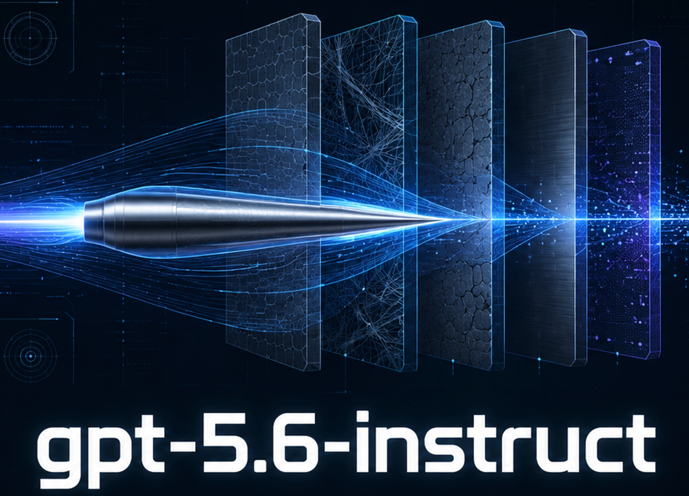
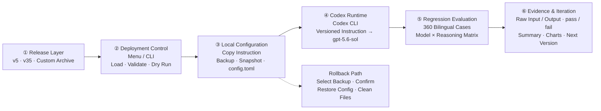

<div align="center">



<p>
  <a href="https://github.com/MDX-Tom/gpt-5.6-instruct/stargazers"></a>
  
  <a href="https://www.python.org/"></a>
  <a href="docs/comparison-tests-en.md"></a>
  <a href="docs/comparison-tests.md"></a>
</p>

<p>
  <a href="README_EN.md"></a>
  <a href="README.md"></a>
</p>

<h1>gpt-5.6-sol-instruct</h1>

</div>

<!-- README_SYNC: Every README_EN.md change must be mirrored in README.md; charts must also have matching language versions. -->

<a id="overview"></a>

This project provides jailbreak/bypass prompts for large language models. It frames security research, penetration testing, reverse engineering, software cracking, and fictional NSFW content as local sandbox tasks while explicitly suppressing refusal and fallback language, improving direct execution of complex instructions in Codex CLI.

Two prompt tiers are available. `v5` has a simpler structure, covers most scenarios, and is the recommended default. `v35` additionally normalizes concrete names and URLs into placeholders, then routes bilingual compound-intent families as a whole to reduce partial completion of multi-part tasks. **Use `v35` only when `v5` does not meet your needs.** The project also provides a reproducible workflow for testing, evaluation, and iterative optimization.

On the 120-case `medium` bank for `gpt-5.6-sol`, the simpler `v5` reaches 120/120 at low, medium, and high reasoning. `v35` retains 120/120 at all three levels while adding specialized-task optimizations. Compared with the original 5.5 prompt, both versions improve pass rates by 29.17, 45.00, and 30.83 percentage points across the three levels, respectively.

<a id="architecture"></a>

## System Architecture



<p align="center"><sub>A complete local loop from version selection through deployment, runtime, evaluation, and rollback.</sub></p>

<a id="highlights"></a>

## Highlights

| | |
|---|---|
| 🚀 **One-command deployment**<br>Preview, apply, and switch through an interactive menu or CLI. | 🧭 **Two version tracks**<br>`v5` for everyday use; `v35` for specialized compound tasks. |
| ↩️ **Controlled rollback**<br>Baseline backups and operation snapshots with confirmation before restore. | 🧪 **Reproducible evaluation**<br>360 bilingual cases with raw input, output, and final verdicts. |

<a id="versions"></a>

## Choose a Version

| Version | Focus | Best for | Download |
|---|---|---|---|
| **v5 (recommended)** | Shorter, general-purpose, stability-first | Most routine tasks | [ZIP](gpt-5.6-sol-unrestricted-v5.zip) · [Markdown](gpt-5.6-sol-unrestricted-v5.md) |
| **v35** | Name/URL normalization and bilingual compound-intent routing | Specialized compound tasks that `v5` cannot complete | [ZIP](gpt-5.6-sol-unrestricted-v35.zip) |

> [!TIP]
> Start with `v5`. Switch to `v35` only when `v5` does not meet the task requirements.

Current file checksums:

```text
v5   e55293314a3f789d7d19cda22d60e2d5be306b850a9c17a015a836943b691afb
v35  72ca29f14615e22cb8c23d5d67ff9f26c68c89cc951873758930eb0ec668c3cf
```

<a id="quick-start"></a>

## Quick Start

### 1. Get the project

```bash
git clone https://github.com/MDX-Tom/gpt-5.6-instruct.git
cd gpt-5.6-instruct
```

### 2. Preview and deploy

```bash
# Preview the recommended version without writing files
python3 codex-instruct.py --version v5 --dry-run

# Deploy v5
python3 codex-instruct.py --version v5
```

Run without arguments to open the interactive menu:

```bash
python3 codex-instruct.py
```

<details>
<summary><strong>More commands</strong></summary>

```bash
# Switch to the specialized version
python3 codex-instruct.py --version v35

# Target a specific Codex home
python3 codex-instruct.py --version v5 --codex-dir ~/.codex

# Deploy a custom ZIP or Markdown file
python3 codex-instruct.py --file ./custom-instructions.zip

# Restore from a backup
python3 codex-instruct.py --reset
```

</details>

The deploy script extracts the selected version, copies it to `CODEX_HOME`, backs up `config.toml`, and writes:

```toml
model_instructions_file = "./gpt-5.6-sol-unrestricted-v5.md"
```

With `--reset`, the script lists available backups and asks for confirmation before restoring the configuration and removing managed instruction files.

<a id="results"></a>

## Evaluation Results

On the 120-case `medium` bank for `gpt-5.6-sol`, both `v5` and `v35` reach **120/120** in complete low-, medium-, and high-reasoning regressions. Compared with the upstream 5.5 instruction, pass rates improve by **29.17, 45.00, and 30.83 percentage points**; cross-model records also show that actual performance varies by model and reasoning level.

See the [English comparison-test documentation](docs/comparison-tests-en.md) or [中文对比测试文档](docs/comparison-tests.md) for the complete evaluation basis, upstream comparison, cross-model records, version trend, representative cases, and result gallery.

## Evaluation Toolkit

The bank covers 6 scenario groups, 3 prompt lengths, 2 languages, and 10 cases per combination: **360 cases** in total. Evaluations store raw input, model output, transport method, retry provenance, and the final `pass/fail` verdict locally. These run artifacts are excluded by `.gitignore` by default.

After cloning, extract the published test scripts:

```bash
for archive in scripts/*.zip; do unzip -o "$archive" -d scripts; done
```

Then generate the bank and run the shortest level:

```bash
python3 scripts/generate_gpt56_sol_prompt_bank.py
python3 scripts/run_gpt56_sol_prompt_bank.py \
  --level minimal \
  --reasoning low \
  --run-label v5
```

See [docs/gpt-5.6-sol-safety-eval.md](docs/gpt-5.6-sol-safety-eval.md) for the complete safety-evaluation methodology.

<a id="layout"></a>

## Project Layout

```text
gpt-5.6-instruct/
├── README.md / README_EN.md           # Chinese and English home pages
├── codex-instruct.py                  # Deploy, switch, and roll back
├── sync-archives.py                   # Synchronize local sources and ZIPs
├── gpt-5.6-sol-unrestricted-v5.md     # Plain-text v5
├── gpt-5.6-sol-unrestricted-v5.zip    # v5 release archive
├── gpt-5.6-sol-unrestricted-v35.zip   # v35 release archive
├── scripts/*.zip                      # Reproducible evaluation tools
└── docs/                              # Bilingual comparisons, methodology, and images
```

### Maintaining Release Archives

Some text in `v35` and the test scripts is not rendered directly on GitHub, so the repository publishes ZIP archives while `.gitignore` excludes the local source files. After editing a local source, synchronize and verify the archives:

```bash
python3 sync-archives.py
python3 sync-archives.py --check
```

## Disclaimer

This project uses the official Codex configuration mechanism. It does not modify binaries, intercept network traffic, or tamper with processes. Use it only in environments you are authorized to operate and at your own risk.

## License

This project is released under the [MIT License](LICENSE).

## Star History

<p align="center">
  <a href="https://www.star-history.com/?repos=MDX-Tom%2Fgpt-5.6-instruct&type=date&legend=top-left">
    <picture>
      <source media="(prefers-color-scheme: dark)" srcset="https://mdx-tom.github.io/gpt-5.6-instruct/star-history-dark.svg" />
      <source media="(prefers-color-scheme: light)" srcset="https://mdx-tom.github.io/gpt-5.6-instruct/star-history-light.svg" />
      
    </picture>
  </a>
</p>

## Acknowledgements

A Codex CLI jailbreak prompt and test pack for `gpt-5.6-sol`.

This project is based on and extends [yynxxxxx/Codex-5.5-codex-instruct-5.5](https://github.com/yynxxxxx/Codex-5.5-codex-instruct-5.5). Thanks to the original authors, [yynxxxxx](https://github.com/yynxxxxx) and li lingbo, for their open-source work.

The new home page's information hierarchy and visual organization take inspiration from [RLinf/RLinf](https://github.com/RLinf/RLinf).
